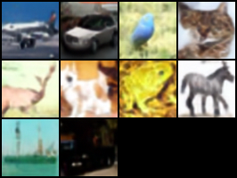
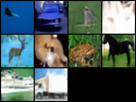
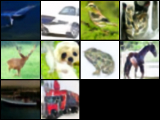

# Implementation of DDPM for image generation

This is an implementation of [this](https://www.youtube.com/watch?v=TBCRlnwJtZU&list=LL&index=5&pp=gAQBiAQB) youtube tutorial. This code has the particularity of having been implemented in Pytorch Lightning and the diffusers library to implement the scheduler.

You can probably improve the results by playing with the hyperparameters; however, I was only interested in the implementation and not so much in the quality.

Some examples of sets of 10 pictures generated with CIFAR: 

Example 1

Example 2

Example 3

